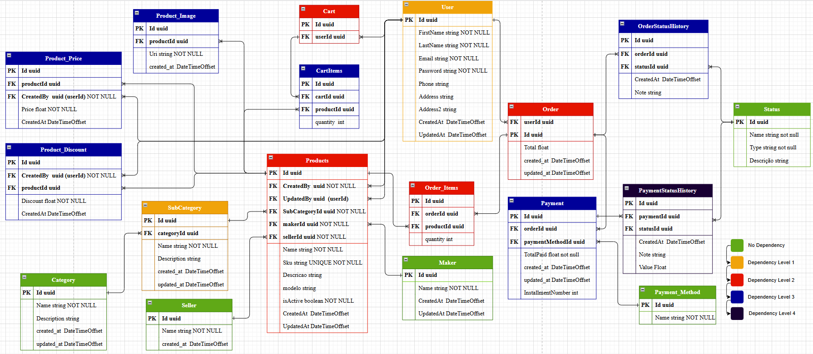

# ECOMMERCE-API

*Empowering Commerce Through Seamless, Secure Innovation*


---

*Built with the tools and technologies:*


---

## 📸 Visão Geral do Projeto


*Modelo de dados completo da aplicação (ERD)*

---

## 📚 Table of Content
- [Overview](#overview)
- [Getting Started](#getting-started)
  - [Prerequisites](#prerequisites)
  - [Installation](#installation)
  - [Usage](#usage)
  - [Testing](#testing)

 ---
## Overview
ECommerce-API is a powerful backend framework tailored for building scalable and secure e-commerce platforms. It emphasizes modular architecture, containerized deployment, and robust testing to streamline development and maintenance.

#### Why ECommerce-API?

This project helps developers create reliable, maintainable online store backends with features like:

- 🧩 **Modular Design**: Supports domain-driven development for scalable and organized codebases.
- 🐳 **Containerized Deployment**: Uses Docker Compose for consistent environments across development, testing, and production.
- 🔐 **Secure Authentication**: Integrates Keycloak for seamless user authentication and role management.
- 🧪 **Comprehensive Testing**: Includes extensive unit tests to ensure application robustness.
- ⚙️ **Config & Seeding**: Facilitates reliable data management with detailed configuration and seed data.

---

## Getting Started

### Prerequisites
This project requires the following dependencies:

- **Programming Language**: CSharp
- **Package Manager**: Nuget
- **Container Runtime**: Docker

### Installation
Build ECommerce-API from the source and install dependencies:

#### 1. Clone the repository:
```bash
git clone https://github.com/Hugo19S/ECommerce-API
```

#### 2. Navigate to the project directory:
```bash
cd ECommerce-API
```

#### 3. Install the dependencies:
**Using** docker:
```bash
docker build -t Hugo19S/ECommerce-API .
```

**Using** nuget:
```bash
dotnet restore
```

### Usage
Run the project with:

**Using** docker:
```bash
docker run -it {image_name}
```

**Using** nuget:
```bash
dotnet run
```

### Testing
Ecommerce-api uses the {test_framework} test framework. Run the test suite with:

**Using** docker:
```bash
echo 'INSERT-TEST-COMMAND-HERE'
```

**Using** nuget:
```bash
dotnet test
```

[⬆ Return](#-table-of-content)
